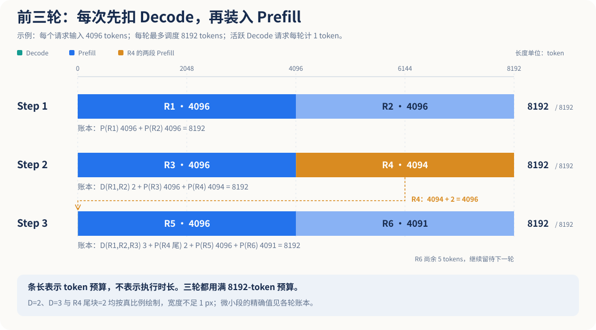
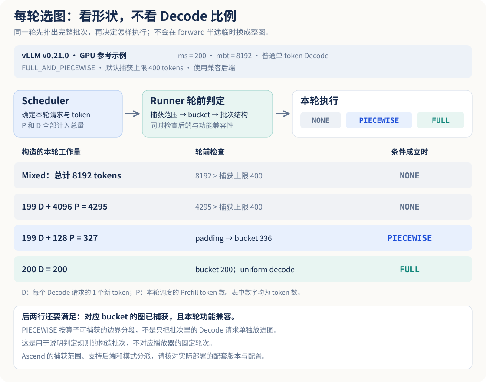
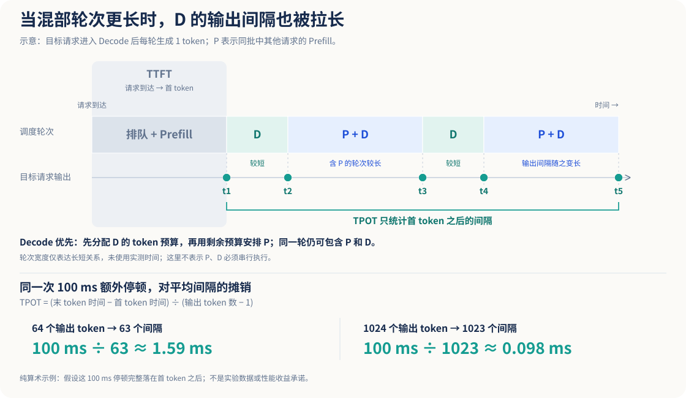
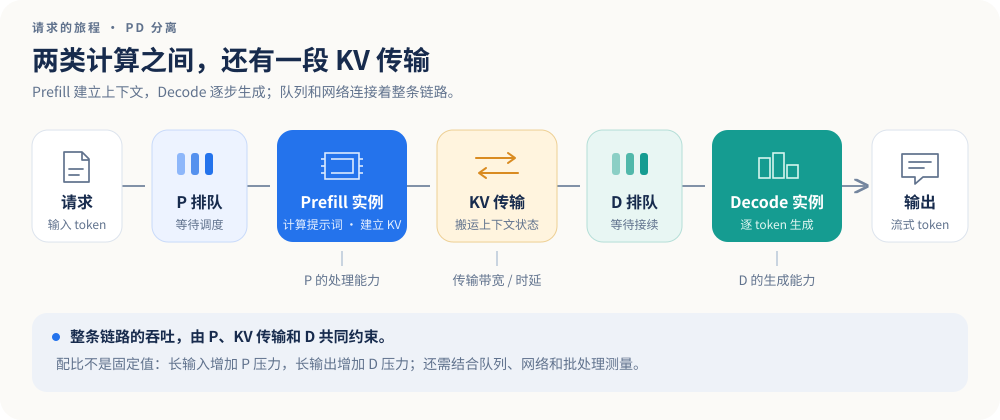
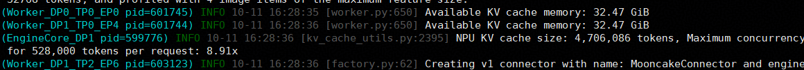
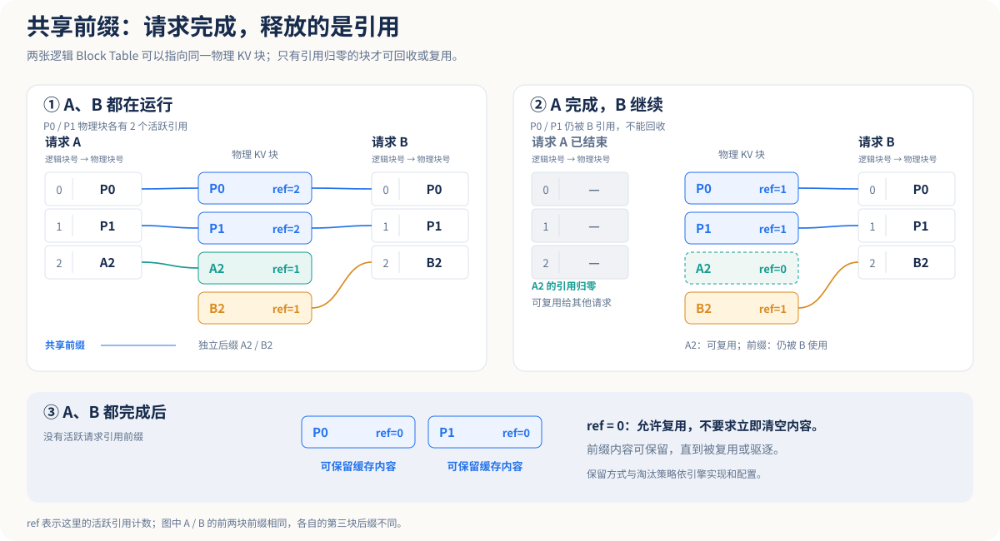
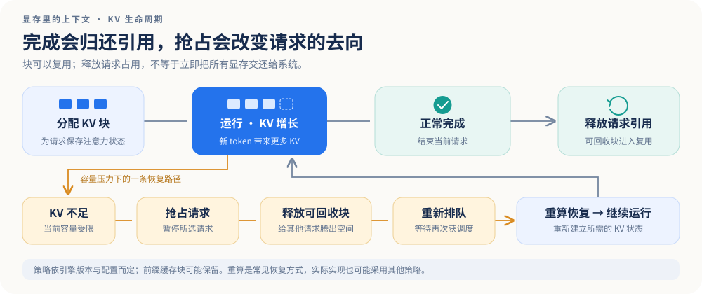

# LLM 推理调度与执行

混部与 PD 分离、逐轮选图、稳态测试及 KV Cache。

先考虑混部场景下，vLLM Ascend 引擎设置了 `max-num-seqs=200`、`max-num-batched-tokens=8192`；后续我会把这两个变量称为 **ms** 与 **mbt**。这时候我使用测试工具，例如 AISBench，往引擎发送请求，始终保持未收回的请求为 200 条，输入为 4K、输出为 1K，这是一个背景信息。

首先在这个混部场景下，我认为可以分阶段来看：第一批 P 请求怎么进来，后面怎么组装 P 和 D，再看请求结束后补入新 P 会发生什么。接着看每一轮怎样选择图执行，以及原来的两个问题：为什么输出短时 TPOT 可能很长、为什么要做稳态测试。之后再看 PD 分离、抢占与 KV Cache 的释放。

> 本文中的数字是教学推演，不是实测结果。具体行为必须结合部署的引擎、Ascend 后端、AISBench 配置、模型和启动日志核对。

## 1. 先约定教学模型

这里的 4K、1K 分别按 **4096 Token**、**1024 Token** 计算。客户端采用闭环补请求：一条返回后再补一条，使有剩余测试数据时在途请求数尽量维持 **200**。实际输入长度要以应用聊天模板、Tokenizer 之后的 Token 数为准，不能把 4096 个字符直接当成 4096 Token。

为了把调度过程画清楚，以下算例额外假设：

- 启用 **Chunked Prefill**；使用“先满足可执行 Decode，再用剩余 Token 预算安排 Prefill”的简化策略。
- 每个请求只有一条输出序列；不启用投机解码；采用同步逐轮示意，一条 Decode 序列每轮计算一个新 Token。
- 没有前缀缓存命中、没有抢占，KV 空间足够；不加入多模态、流水线、异步调度等额外限制。
- Prefill 可以按预算任意切块；不施加额外的单请求 Chunk 上限、部分 Prefill 数量限制或块对齐限制；本例只受 ms、mbt 和请求状态限制。

上述策略与 vLLM 官方 Chunked Prefill 文档的说明相符；真实实现还有其他调度条件，不能将本例当作所有后端与配置的保证。[vLLM 优化文档](https://docs.vllm.ai/en/latest/configuration/optimization/)、[调度器源码参考](https://github.com/vllm-project/vllm/blob/main/vllm/v1/core/sched/scheduler.py)

### 1.1 四个容易混淆的量

| 量 | 本例含义 | 容易产生的误解 |
| --- | --- | --- |
| 客户端并发 200 | 已发出、尚未完成的请求数目标，包含服务端等待中的请求 | 200 条都在做 Decode |
| ms = 200 | 每轮可处理的序列数上限；本例每请求一条序列 | 服务端只能接收 200 条请求 |
| mbt = 8192 | 每轮新计算的 Token 预算上限，P 与 D 共用 | KV 只能保存 8192 Token，或每轮必须填满 |
| KV Cache 容量 | 保存已经计算过的上下文状态所需的块空间 | 由 ms 或 mbt 直接决定 |

ms 与 mbt 是不同维度的约束；KV 是否足够还取决于模型结构、精度、并行方式、可用显存、上下文长度和缓存共享情况。不同实现可能把运行态准入与每轮序列容量进一步分开，因此应核对实际参数定义。[vLLM SchedulerConfig](https://docs.vllm.ai/en/latest/api/vllm/config/scheduler/)

## 2. 一个请求的生命周期

```text
客户端发送 → 排队 → Prefill（可分成多块）→ 首 Token → Decode → 完成 → 归还 KV 块引用
                    └────────────── 构建并持续使用 KV Cache ──────────────┘
```

**P（Prefill）**处理输入上下文并构建 KV Cache；**D（Decode）**利用已有 KV Cache，逐步生成后续输出。同一混部实例的一轮计算可以同时包含 P Token 和 D Token。

一次完整 Prefill 结束时，通常已经可以采样首个输出 Token；所以“输出 1024 Token”不能机械地解释成“Prefill 后还必须做 1024 轮 Decode”。在本例同步、无投机的模型里，可以理解为首 Token 后再生成约 1023 个 Token。真实首 Token 发送时点还受到执行和流式返回实现影响。

教学中的 P/D 是工作类型标签。V1 调度器源码以已计算 Token 数和待计算 Token 数统一描述请求，并非必须维护两个独立的 P/D 队列。[V1 调度器源码说明](https://github.com/vllm-project/vllm/blob/main/vllm/v1/core/sched/scheduler.py)

### 2.1 一轮调度怎么真正进入模型执行？

**资料参考｜GPU 单进程执行链。** `EngineCore.step()` 先调用 `Scheduler.schedule()`，拿到 `SchedulerOutput`，再交给执行器；调度器并不直接运行模型。输出结构包括各请求本轮调度的 Token 数、新请求数据与 KV 块编号等信息，因此它描述的是“本轮算哪些 Token、使用哪些状态”。[EngineCore](https://github.com/vllm-project/vllm/blob/main/vllm/v1/engine/core.py)、[SchedulerOutput](https://github.com/vllm-project/vllm/blob/main/vllm/v1/core/sched/output.py)

```text
EngineCore.step()
  ├─ Scheduler.schedule() → SchedulerOutput
  ├─ UniProcExecutor.execute_model(scheduler_output, non_block=True)
  │    └─ collective_rpc("execute_model", ...) → run_method(driver_worker, ...)
  │         └─ WorkerWrapperBase.execute_model()
  │              └─ Worker.execute_model()
  │                   └─ GPUModelRunner.execute_model()
  │                        └─ 准备输入 / Attention 元数据 → _model_forward() → self.model(...)
  ├─ 等待执行结果；若返回 None，再调用执行器的 sample_tokens(...)
  └─ Scheduler.update_from_output(...) → 更新请求进度、完成状态与输出
```

这里 `self.model_executor` 的具体类型选为 `UniProcExecutor`：它通过 `collective_rpc` 调用持有 Worker 的包装对象，再由 GPU `Worker.execute_model()` 调用 `model_runner.execute_model()`。Runner 更新持久批状态、准备本轮输入和 Attention 元数据，最终进入模型前向。执行器后端、流水线和异步设置会改变具体执行路径，这张调用链只追踪上述参考路径。[UniProcExecutor](https://github.com/vllm-project/vllm/blob/main/vllm/v1/executor/uniproc_executor.py)、[WorkerWrapperBase](https://github.com/vllm-project/vllm/blob/main/vllm/v1/worker/worker_base.py)、[GPU Worker](https://github.com/vllm-project/vllm/blob/main/vllm/v1/worker/gpu_worker.py)、[GPU Model Runner](https://github.com/vllm-project/vllm/blob/main/vllm/v1/worker/gpu_model_runner.py)

**教学推导。** “先分配 D 的预算”与“D 在设备上先独立执行完、立刻返回”不是同一件事；本轮调度输出仍可能组织成一个混合批次。调度顺序本身不能给出这轮的毫秒数。

**待验证。** 当前项目没有提供实际部署配置；上述 GPU 类名不代表 Ascend 的 Worker/Runner 类名。要解释某次 NPU 实测，应核对执行器、后端、异步设置和相应实现路径，不能直接套用这里的调用链。

## 3. 混部调度：沿着预算逐轮看

播放器把“本轮执行了什么”和“轮末请求处于什么状态”分开显示。本轮 Decode 条数是这一轮实际推进的请求数；轮末四类状态则是所有请求的互斥划分：未入场、输入未处理完、待后续 Decode、全部输出完成。输入完成的请求可能刚在本轮产生首个输出，要从下一轮才加入 Decode。

例如第 7 轮：本轮执行 11 条 Decode；R12、R13 本轮完成输入，R14 还差 37 个输入 Token。轮末状态为 `186 + 1 + 13 + 0 = 200`，其中运行中的 14 条是 `1 条输入未完 + 13 条待后续 Decode`。“全部输出完成 0”不是说没有请求完成 Prefill，也不表示设备同时只执行一条请求。

先截取最初到达的 200 条请求，在首个请求完成前推演；这段时间还没有“完成后补入”的新请求。下面总输入 `200 × 4096` 也只计算这最初一批。若是在完整的 200/200 单波测试中，后续没有补入；若继续保持闭环负载，则从首个完成开始，就必须把新来的 P 一起算进去。尤其输出为 64 时，可能在最初 200 条都做完 Prefill 前便开始替换，不能继续套用长输出单波的阶段。

### 3.1 第一轮：只有 Prefill

第一个阶段是第一批到达的 P 请求。这时候还没有 D，能在这一轮做完整 Prefill 的就是两个，`4096 + 4096 = 8192`，这时候就达到了 mbt 的上限：

```text
本轮 Token 预算 8192
┌──────────────────────┬──────────────────────┐
│ R1 Prefill：4096      │ R2 Prefill：4096      │
└──────────────────────┴──────────────────────┘
```

这里限制的是“本轮能够计算多少新 Token”。其他请求仍可处于等待中。ms 的 200 个名额没有填满，也不意味着必须等待更多请求凑成一批。

### 3.2 第二轮：先 D，再用剩余预算放 P

第二个阶段就是前面两条请求开始进入 D 状态。这时候下一个 step 就开始组装 P 和 D，也就是“2D + 2P”。R1、R2 各占本轮 1 个 D Token，剩余 `8192 − 2 = 8190`，够放一个完整的 P，以及另一个 P 的一部分：

```text
R1 D：1 + R2 D：1 + R3 P：4096 + R4 P：4094 = 8192
                                              └─ R4 还差 2 个输入 Token
```

因此，“2D + 2P”只表示四条序列参与本轮，不表示两个 P 都已完成。R4 需要保留已经完成的 Prefill 进度和对应 KV。

### 3.3 第三轮：先补完旧 Chunk，再接新请求

然后来到下一轮，这时候 R1、R2、R3 可以 Decode，R4 还在 Prefill。三条 D 占 3 个 Token，剩余 `8189`；先把 R4 剩下的 2 个补完，再放一个完整 P，最后放进一个不完整 P：

```text
3 个 D：3 + R4 P 尾块：2 + R5 P：4096 + R6 P：4091 = 8192
                                                    └─ R6 还差 5 个
```

| 轮次 | 本轮 D Token | 本轮 P Token 的组成 | 合计 | 轮末结果 |
| --- | ---: | --- | ---: | --- |
| 1 | 0 | R1 4096 + R2 4096 | 8192 | R1、R2 可继续 D |
| 2 | 2 | R3 4096 + R4 4094 | 8192 | R3 可继续 D；R4 剩 2 |
| 3 | 3 | R4 尾块 2 + R5 4096 + R6 4091 | 8192 | R4、R5 可继续 D；R6 剩 5 |

这些计算是本例假设下的手算结果。实际 Trace 可能因为额外限制、缓存命中或调度顺序而不同。



图中每轮总预算都是 8192。R4 在第二轮留下的 2 个 Token 需要在第三轮接续；把请求画成完整色块时，也不能把它误读成已经完成整个 Prefill。

### 3.4 为什么会出现纯 D？会持续多久？

随着更多 Prefill 完成，D 的数量增加。若 200 条在途请求最终都进入 D，那么已经没有待 Prefill 的请求；在本例准入模型里，序列名额也已占满。此时会出现纯 D 轮次。

**纯 D 段不一定短。** 最初 200 条请求总输入为 `200 × 4096 = 819200 Token`，即使完全没有 D 开销，也至少需要 100 个满预算轮次完成全部 Prefill；加上混部 D 开销，还要更多轮。在本例长输出、无抢占的简化模型中，最早请求生成 1024 个输出 Token 所需的轮次远多于这个装填过程，因此首个请求完成前便可能有很长一段纯 D。对 200/200 单波测试，后续会沿着纯 D 继续完成与排空；对持续闭环测试，完成后补入的 P 会再次改变工作组成。

反过来，如果输出较短、请求持续交错到达，或者出现抢占，就可能还没全部进入 D，早到的请求已经完成。实际系统不一定呈现整齐的“纯 P → 混合 P/D → 纯 D”三段。

有请求完成后，客户端若还有数据就补发新请求；新请求经过排队、准入和 Prefill，再进入 D。**空出一个序列名额，只代表具备接入新工作的条件，仍需检查 Token 预算和 KV 空间。**

留两个问题，大家可以思考一下：

1. 为什么输出短的时候，比如 64，会出现 TPOT 很长的情况？
2. 为什么需要稳态测试？使用 AISBench 测试时，并发/总请求 200/200 和 200/800 有什么区别？

### 3.5 D 越来越多，能在中间某一轮改用图吗？

可以，切换点在**某一轮前向开始之前**。Scheduler 给出本轮工作量，Runner 再按当前 batch 选择执行路径；同一个混部实例可以上一轮不用图、下一轮回放图，后续补入新 P 时再重新选择。已经执行到一半的前向，不会因为请求阶段变化而临时把后半接成另一张完整图。[vLLM 图执行设计](https://docs.vllm.ai/en/latest/design/cuda_graphs/)

先分清“图模式”指什么。这里讨论 GPU 的 CUDA Graph、Ascend 的 ACLGraph 捕获与回放。通常启动时先对有限的 batch 档位预热、捕获，运行时更新输入和元数据，选择匹配的图回放；不是线上遇到任何新形状就自动临时捕获。图回放可以减少重复提交设备工作的 CPU 开销，但不代表省掉 Attention 计算或 KV 访问。[vLLM 图捕获与回放](https://docs.vllm.ai/en/latest/design/cuda_graphs/)、[Ascend 图模式说明](https://docs.vllm.ai/projects/ascend/en/main/user_guide/feature_guide/graph_mode.html)

| 本轮运行时模式 | 怎么执行 |
| --- | --- |
| `NONE` | 不回放设备图；这与代码是否经过 `torch.compile` 是不同问题 |
| `PIECEWISE` | 沿算子边界把支持的计算片段放进图，不兼容部分在图外执行；不是只把 D 请求抽出来进图 |
| `FULL` | 整个模型前向走完整图；能否包含 P/D 混合 batch 要看配置和后端 |

`FULL_AND_PIECEWISE` 是一种配置策略，不是第四种运行时模式：在满足图条件时，uniform decode 走 FULL，其他 batch 走 PIECEWISE；没匹配图则回到 NONE。普通单 Token 解码中，uniform decode 通常要求本轮每条请求都调度 1 个 Token，不能只看请求被标成了 D；投机解码的统一 query length 可能更大。[图模式定义与运行时匹配](https://docs.vllm.ai/en/latest/design/cuda_graphs/)

**教学对照｜显式选定的图配置。** 取 ms=200、mbt=8192，普通单 Token D、无 LoRA，选择 `FULL_AND_PIECEWISE`；手动选定最大捕获尺寸 400，并包含 200、336 档位，假设对应图已捕获、后端及功能组合兼容。这里的 400、200、336 是教学配置，不是引擎通用默认值；8192 仍是调度预算。



| 本轮工作量（构造示例） | 新 Token 总量 | 在上述条件下的路径 |
| --- | --- | --- |
| P/D 混合，预算用满 | 8192 | 超过 400，NONE |
| 199 个 D + 1 个 P 的 4096-Token chunk | 4295 | 虽然 99.5% 请求是 D，仍超过 400，NONE |
| 199 个 D + 1 个 P 的 128-Token 尾块 | 327 | padding 到 336 档位，匹配后走 PIECEWISE |
| 200 个 D，每条前进 1 Token | 200 | 匹配 uniform decode 的 200 档位，走 FULL |

这些例子用于隔开“请求比例”和“本轮形状”，不代表播放器必然出现对应轮次。捕获档位还会受自定义配置、并行策略和后端限制；“全部是 D”也不是充分条件。强制 eager、图未启用、没有兼容的捕获图或功能组合受限，都可能让该轮不用完整图。[图尺寸与模式匹配](https://docs.vllm.ai/en/latest/design/cuda_graphs/)

**Ascend 后端边界。** 后端支持范围会变化：有些 Attention 后端支持混合 batch 的完整图，有些对 query 长度或批次结构有限制。因此不能写“只要还有 P，就绝对不能 FULL”；`FULL` 与 `FULL_AND_PIECEWISE` 的策略也不同。并行方式和功能组合还会影响最终模式，应按实际配置与 Trace 判断。上面的 400 上限是手动选定的教学条件，不能套给未知部署。[Ascend 图模式说明](https://docs.vllm.ai/projects/ascend/en/main/user_guide/feature_guide/graph_mode.html)

在 PD 分离里，D 实例通常更容易持续出现 uniform decode 形状，因此可以单独考虑 `FULL_DECODE_ONLY`；它同样需要满足图覆盖和后端条件。P 端能否用图仍应另查，PD 分离本身不保证任何一端采用图。

要确认当前机器有没有切换，先记录有效图配置、捕获档位、Attention 后端，再对齐每轮 P/D Token、padding 后形状、runtime mode 和设备 Trace。尚无这些证据时，只能说明“具备逐轮切换机制”，不能认定某次 TPOT 改善来自图执行。

## 4. 思考题一：输出只有 64，为什么 TPOT 可能很长？

先看测量时间线：



```text
请求发送 ─────────── 首 Token ── Token 2 ── Token 3 ───── 最后 Token
         ←── TTFT ──→           ←─ 首 Token 之后的生成时间 ─→
         ←──────────────── E2EL ────────────────────────→
```

AISBench 将 TTFT 描述为首 Token 返回延迟，将 TPOT 描述为排除首 Token 后的平均输出 Token 生成延迟。[AISBench 性能指标](https://github.com/AISBench/benchmark/blob/master/docs/source_en/base_tutorials/results_intro/performance_metric.md)

常用的逐请求口径为 `TPOT = (E2EL − TTFT) / (输出 Token 数 − 1)`，要求输出多于 1 个 Token。vLLM 官方压测代码使用这一口径；使用 AISBench 时还应核对实际工具的计算实现、流式返回与 Token 计数方式。[vLLM 压测指标源码](https://github.com/vllm-project/vllm/blob/main/vllm/benchmarks/serve.py)

这里按逐 Token 内容事件解释时间线。成组输出或代理缓冲时，客户端 ITL 样本可能是输出事件间隔，不能直接视作逐 Token 生成间隔，详见[投机解码与流式指标](投机解码与流式指标.md)。

在当前混部算例中，较短输出可能更早结束：

1. 早到请求的整个 Decode 生命周期都处于后续长输入持续加入的装填期，几乎享受不到长输出请求后面那段纯 D 计算。
2. D 优先只是先分配本轮预算；同一轮混入的长 P 仍可能拉长整轮执行时间，因此 D Token 的返回间隔也会变长。
3. 短输出只有 63 个后续 Token 间隔，少数停顿更容易抬高逐请求均值。例如仅作算术示意：一次 100 ms 的额外停顿，对 64 输出的 TPOT 贡献约为 `100/63 = 1.59 ms`；对 1024 输出约为 `100/1023 = 0.098 ms`。
4. 闭环负载下，短请求完成得快，可能更频繁触发新 Prefill；KV 抢占、网络抖动和客户端瓶颈也可能放大停顿。

所以“短输出 TPOT 超长”是需要验证的现象，不是短输出的必然属性。TTFT 本身较长，也不能直接推出 TPOT 较长，因为上述 TPOT 口径已经扣除了 TTFT。应将请求到达时间、每轮 P/D 组成、逐 Token 间隔和抢占事件放在同一时间线上分析。Chunked Prefill 的预算大小会影响 P/D 干扰与 TTFT/ITL 的取舍。[vLLM Chunked Prefill 调优说明](https://docs.vllm.ai/en/latest/configuration/optimization/)

### 4.1 Decode 优先，为什么仍会受到 Prefill 干扰？

**源码事实。** 前面的 GPU 单进程参考链说明，预算分配与模型执行是两个层次；`GPUModelRunner` 依据本轮所有请求组织输入，再进入前向。这不等于先跑完一个独立 D batch，再开始 P batch。长 Prefill 混入本轮后，实际耗时还受到算子形状、上下文长度、访存和通信影响。

**教学推导。** 假设一条请求的相邻两个输出，分别来自连续的同步轮次 k 和 k+1，那么它的 ITL 不只取决于“本轮 D 占 1 个预算”，还受后一轮执行与发送等开销影响。如果轮次 k+1 携带较重的 P，即使 D 先拿到了预算，它也没有获得一个固定的时延保证。首 Token 后发生的调度或抢占等待，仍会进入 TPOT；被扣除的是首 Token 之前的 TTFT。

因此 Chunked Prefill 调优是在分配单轮工作量：较小的 mbt 可以限制单轮混入的 P，倾向于保护 ITL，但 P 需要更多轮推进，可能增加 TTFT 与调度/启动开销；较大的 mbt 能一次推进更多输入、减少切块次数，也可能让混合轮次更重。具体吞吐和时延曲线取决于模型、设备、实现与负载，不能由 8192 这个数直接推断最优点。[vLLM 调优文档](https://docs.vllm.ai/en/latest/configuration/optimization/)

## 5. 思考题二：200/200 和 200/800 测到的是同一种状态吗？

这里的写法是“**客户端最大并发 / 总请求数**”。比较时假设请求结束就补发，且没有额外 QPS 限速；如果使用固定速率发送，负载模型已经改变，不能仅凭这两个数字推断流量形状。AISBench 的 `batch_size` 用来配置发送最大并发，总请求量和发送速率则是另外的设置。[AISBench README](https://github.com/AISBench/benchmark/blob/master/README_en.md)、[性能测试说明](https://github.com/AISBench/benchmark/blob/master/docs/source_en/base_tutorials/scenes_intro/performance_benchmark.md)

| 负载 | 过程 | 能回答什么 | 主要限制 |
| --- | --- | --- | --- |
| 200/200 | 发出一波，之后只等待完成 | 单波突发、排队、装填与排空表现 | 没有持续补请求；客户端并发随完成而下降 |
| 200/800 | 初始最多 200，在前 600 条后续请求仍可补入时持续替换 | 更接近持续负载，能观察补入 P 对 D 的干扰 | 只有有限的替换周期；仍有启动与排空，不能保证达到稳态 |

`200/800` 不是同步执行的四个固定批次。请求按各自完成时间异步补入，P/D、上下文长度和 KV 占用分布可能持续变化；当数据发完后，依然进入排空期。

### 5.1 并发达到 200，是稳态的充分条件吗？

对教学分析而言，**稳态是工作分布在观察窗口内足够稳定**：客户端在途数稳定，同时 P/D 比例、完成速率、排队长度、KV 占用和尾延迟没有持续漂移。并发曲线平了，并不自动证明这些量都稳定。

**教学推导。** 闭环 200 在途还带有反馈：响应变慢，完成与补入的速率就会降低；在足够长的稳定窗口、无客户端思考时间时，平均到达率近似为 `到达 QPS ≈ 平均在途数 / 平均 E2EL（秒）`。因此“在途始终 200”并不意味着 QPS 固定，也不能证明系统在同等固定 QPS 的开放负载下仍然稳定。两种发送方式要分别报告。

AISBench 的 `stable_stage` 汇总器有基于并发时间段选择样本的计算规则；它不能凭空制造一个足够长的稳定负载。官方说明还提醒窗口边界会影响吞吐统计，并给出最大单请求 E2EL 小于窗口时长三分之一的可靠性条件。应以所用工具的定义为准。[AISBench 稳态测试说明](https://github.com/AISBench/benchmark/blob/master/docs/source_en/advanced_tutorials/stable_stage.md)

建议把测试曲线画成三段，并明确报告采用的统计窗口：

```text
并发/工作分布
       装填期          候选稳定窗口             排空期
      ╱───────────────╲
     ╱                 ╲
────╱───────────────────╲──────── 时间
```

稳态测试至少要回答：是否完成模型预热，是否排除启动/排空；稳定窗口是否覆盖足够多次请求替换；模型、Tokenizer、输入/输出实际长度、缓存命中和失败请求是否一致。报告 TTFT、TPOT/ITL 的分位数以及成功请求吞吐，并保留完整测试结果供比较。不能把冷缓存单波测试与热前缀持续测试直接当作同一负载。

## 6. PD 分离：从一次交接到资源池

PD 分离先把 Prefill 与 Decode 交给不同的引擎实例。沿一条请求看，是 P 计算完成后，把继续 Decode 所需的 KV 与控制信息交给 D：



```text
客户端 → Proxy → P 等待队列 → P 计算 → KV 传输/加载 → D 等待队列 → D 计算 → 输出
                                  ↑           ↑
                            传输前需保留源 KV   目标需有可用 KV 空间
```

“两级排队”是理解 P、D 两个计算阶段的起点；完整链路还包括代理路由、网络、KV 传输与目标端加载，不能只看 P 与 D 的算力。

图中箭头表示请求/KV 的依赖关系与可能排队的位置，不要求所有实现把这些阶段整段串行执行。逐层推送可以在 Prefill 尚未全部结束时传输已经产生的层 KV；D 何时获得执行所需状态，以及哪些传输能够重叠，取决于连接器。

先沿着一条请求看交接。**官方文档事实｜vLLM Ascend 的 Mooncake 拉取式例子**，不是所有连接器共用的时序：[PD 设计文档](https://docs.vllm.ai/projects/ascend/en/main/developer_guide/Design_Documents/disaggregated_prefill.html)

1. 请求到 Proxy，先选择 P，P 端负责 Prefill。该例子把 P 请求的输出限制为 1 个 Token，让它完成 Prefill 与本地首 Token 路径；不能据此认为客户端已经收到首 Token，代理如何合并和返回输出还要另看实现。
2. P 算完后返回交接元数据，但 KV 暂时不能覆盖。后面 D 还要读取这些状态，因此这里是“P 端计算结束、等待交接”，整条用户请求并没有结束。
3. Proxy 再选择 D 并转发请求。D 请求先等待远端 KV，调度器为目标 KV 预分配空间；这时候它虽然已经来到 D，也不等于已经开始 Decode。
4. D 发起拉取。拉取完成、确认满足源端释放条件后，才通知 P 归还对应 KV 引用；不能只因为请求已经转发，就把源块拿去覆写。
5. D 有了执行需要的 KV 后继续 Decode。源端释放与 D 后续计算是交接后的两项工作，不能把通知发出当成源块已经在同一瞬间完成回收。D 的 KV 还要保留到后续生成结束或被其他机制回收。

所以 PD 多出来的不只是网络时间，还有 KV 的驻留时间。P 完成到释放确认之间，源 KV 仍可能占着块；D 预分配到实际解码期间，目标块也已经占用。若 D 无法准入或分配目标空间，使拉取迟迟不能开始，P 端 hold 的 KV 就会堆积。若拉取已经完成并确认释放，D 后续的本地排队会继续占用 D 的缓存，但不能再一概说它还占着 P 的源 KV。

P、D 是不同引擎实例，各自有 ms、mbt 与 KV 块池，不能把它们画成共同争抢一份 8192 的预算。PD 也不替代单实例内部调度；P 是否继续使用 Chunked Prefill、D 是否需要本地补算，应查实际后端和连接器配置，这里不假设 D 端永远没有 Prefill。

网页里的 PD 播放器按这些交接事件逐帧演示。一次点击不等于真实引擎的一个 step，动画帧的宽度和播放间隔也不代表传输耗时，不能从动画读出吞吐或 TPOT。

### 129 个输入 Token，D 实际读了多少 KV？

A5 拉取实验中，P、D 各用 TP2，模型有 2 层、2 个 KV heads。每 rank 每层持有 1 个 KV head。按本次 LBNHC 分配路径推导，K 和 V 各有一份 BF16 视图，逻辑轴是 `[物理块, 页内位置, 本地 KV head, 头宽]`，形状为 `[512,128,1,64]`。单个 K 页有 `128×1×64×2 = 16,384 B` 数据，V 页同样大。底层按块交替放置 K 页和 V 页，所以同一份 K 视图的相邻块起点相距 32,768 B。[A5 拉取实验记录](https://github.com/Tflowers-0129/inference-wiki/blob/main/experiments/pd-disaggregation/results/pull.json) · [KV 视图与步幅](https://tflowers-0129.github.io/inference-wiki/kv-cache-layouts.html#kv-cache-layouts-5)

129 个位置要用两页。实测请求在 P 的块表是 `[1,2]`，在 D 的块表是 `[5,4]`，所以逻辑第 0 页从 P1 读到 D5，第 1 页从 P2 读到 D4。每个 D rank 发起一次 READ，包含 `2 页×2 层×2 个组件 = 8` 个地址范围，共 131,072 B。末页只有 1 个有效位置，但 READ 搬运整页，因此有效 KV 是 `129×2×2×1×64×2 = 66,048 B` 每 rank。[拉取路径的地址与传输描述符](https://tflowers-0129.github.io/inference-wiki/pd-disaggregation.html#pd-disaggregation-3)

D 分配到块号后先等远端 KV。执行器收齐两个 Worker 的接收完成回报后，Scheduler 才能把请求放回可调度队列。该代理让 D 用原 prompt 接续，D 在恢复调度时重算末尾位置 128，再采样客户端收到的首 Token。[D 的接收完成与末位置重算](https://tflowers-0129.github.io/inference-wiki/pd-disaggregation.html#pd-disaggregation-4)

### 从 PD 交接引出两种池化

当部署从一对实例变成多 P、多 D 时，代理可以从 P 实例池、D 实例池分别选择承接者；两侧可分别调整实例数和并行配置。池化组织的是一组可路由的实例，单个实例仍有自己的调度预算、本地 KV 块池和执行状态，不是所有设备共享同一份 ms、mbt。独立扩容能力也不意味着配置会自动随负载改变。[Ascend PD 设计](https://docs.vllm.ai/projects/ascend/en/main/developer_guide/Design_Documents/disaggregated_prefill.html)

| 这里说的“池” | 组织的对象 | 主要回答的问题 |
| --- | --- | --- |
| P / D 计算实例池 | 多个 Prefill / Decode 引擎实例 | 请求交给哪一实例，两端各需要多少计算容量 |
| 实例内 KV 块池 | 一个引擎持有的本地缓存块 | 当前请求能否分配、增长和回收 KV |
| 跨实例共享 KV 缓存池 | 可检索、加载与复用的前缀 KV | 已算过的前缀能否被另一请求或实例复用 |

共享 KV 池是可选的状态层，PD 也可以直接用 P2P 交接 KV。Mooncake 的 Transfer Engine 与 Store 可分别采用；不能把“用了 Mooncake 传输”等同于“全部 KV 经过共享池”。[Mooncake 架构](https://kvcache-ai.github.io/Mooncake/design/architecture.html)

在 Ascend 文档给出的组合路径中，P 查询共享 KV 池并加载额外命中的前缀，再处理剩余输入；D 仍通过 P2P 连接器从 P 获取执行需要的 KV。这里减少的是重复 Prefill 工作，仍要计算查询、加载的成本；不是 D 直接在远端存储上做 Attention。复用前应核对命中范围、数据身份及模型和布局兼容性。[Ascend KV Pool 设计](https://docs.vllm.ai/projects/ascend/en/main/developer_guide/Design_Documents/KV_Cache_Pool_Guide.html)

因此，计算池主要改变承接者和容量组织，共享 KV 池改变前缀从哪里获得。选定 P、D 之后，这条请求仍要满足目标空间、KV 到齐和 D 可运行等条件，才会进入下一步。

### 交接拥塞时，看哪一段在等

下面是**教学推导，尚无本项目实测**。要定位瓶颈，需要把 P/D 等待队列、P 计算结束时间、未确认释放的 KV、D 缓存水位与传输耗时放在同一时间轴上。这里的 hold 指“已完成 P、尚未满足源端释放条件的 KV”，不是单独一项已确认存在的监控指标名。

| 现象 | 更需要排查的地方 | 能帮助区分的证据 |
| --- | --- | --- |
| 请求在 P 前越等越久，P 产出跟不上输入；D 经常等不到可运行请求 | P 计算能力、P 准入或路由分布 | P 等待队列增长、TTFT 抬高；若传输正常且 D 本身不拥塞，进入 D 后的 ITL 可能仍稳定。还要检查 P 是否因源 KV hold 过多而无法准入，避免把缓存反压误判成纯算力不足 |
| P 已经算完，但交接与 D 等待越积越多 | 传输链路、D 目标 KV 空间或 D 服务能力 | 传输受限时，交接耗时和未确认 KV 可能一起增长；D 算力/驻留压力较大时，D 就绪队列、KV 水位或 ITL 可能先抬高，再反压交接。传输正常但 D 本地队列长，与远端 KV 一直未到，是两种不同的等待 |

TTFT 是否包含全部 D 等待，要看代理何时第一次向客户端输出；已在 D 稳定生成的请求 ITL 也不能代表还没进入 D 的请求没有拥塞。闭环测试还会因响应变慢而减慢补入，因此最终看见队列“停止增长”时，也要确认是不是请求到达率跟着降了。

### KV 就绪与 D 空闲，缺一不可

R1 正在 Decode 时，R2 可以先传输 KV。若传输在 R1 结束前完成，D 可接着运行 R2；若 R1 已结束、R2 的 KV 还未就绪，且没有其他可运行请求，D 就会等待。前面的交接播放器已展示这两种情况。

P 的源 KV 则要保留到交接完成并处理释放通知。D 能开始计算，与 P 能回收源块，是两个不同的时点。

### 6.1 PD 配比为什么随输入/输出改变？

用相同单位 QPS（每秒处理的请求数）比较，端到端可持续吞吐受最紧的资源约束。教学上可写成上界：

`可持续 QPS ≤ min(P 端 QPS, D 端 QPS, KV 交接 QPS, 其他环节 QPS)`

这只是资源上界，不是实测吞吐等式。批处理效率、队列、传输与计算的重叠、负载不均都会影响实际结果。KV 交接能力还与每请求 KV 数据量、有效带宽和目标内存空间有关。

- 长输入、短输出：通常增加 P 与 KV 交接压力。
- 短输入、长输出：通常增加 D 的持续计算与驻留 KV 压力。
- 前缀命中、长度分布、模型结构或网络改变，也会改变合适的 P:D 资源配比。

因此，针对某一种输入/输出组合调好的配比不能直接复用到所有业务。PD 的重要价值是隔离 Prefill 对 Decode 的干扰，让 TTFT 与 ITL 更容易分别调优；它不保证吞吐增加，也不是消除排队和 KV 压力的开关。[vLLM PD 官方说明](https://docs.vllm.ai/en/latest/features/disagg_prefill/)

### 6.2 用 QPS 计算 P:D 配比

固定输入输出分布、批处理和单实例资源配置，分别测出一个 P 实例和一个 D 实例能处理的 QPS，记为 QPS_P、QPS_D。D 端统计的是完成每条请求所需的全部 Decode 工作，不是每秒生成的 Token 数。若配置 nP、nD 个实例，暂不计扩展损失和负载不均：

```text
目标 QPS < nP × QPS_P
目标 QPS < nD × QPS_D
容量平衡起点：nP : nD ≈ QPS_D : QPS_P
```

例如，若实测单个 P 为 8 QPS、单个 D 为 2 QPS，1 个 P 配 4 个 D 才接近两端容量平衡：两端都是 8 QPS。这只是配比示例，运行时仍要留出余量，并检查交接带宽、负载不均和尾延迟。

若只有 Token 吞吐数据，固定输入 I、输出 O，且 P 产生的首 Token 计入最终输出、D 只继续 O−1 个 Token，则 `QPS_P ≈ RP/I`、`QPS_D ≈ RD/(O−1)`。RP、RD 分别是相应工作负载下的输入和 Decode Token 吞吐；需要测量，不能用设备峰值算力或含排队的 TTFT、E2EL 替代。

nP、nD 是配置固定的实例数。若 P、D 每实例占用的设备数不同，还需换算总设备数与成本。

### 6.3 KDA 与 Lightning Indexer + DSA：交接的状态怎样算？

先区分两种状态：KDA 把历史压入递归状态；Lightning Indexer + DSA 保留历史缓存，再为当前 Query 选择参与 Attention 的位置。以下按**单请求、单个续算边界、完整逻辑单副本**计算，不含模型权重、临时工作区、块尾浪费、对齐与额外检查点；MiB = 2²⁰ 字节。

#### KDA：递归矩阵与短卷积状态都要保存

单个 KDA 层保存每头一个 `dk × dv` 的递归矩阵，以及 Q、K、V 的短卷积边界状态。设 KDA 层数 LK、头数 H、卷积缓存宽度 w，递归和卷积状态每元素分别为 sr、sc 字节：

```text
MKDA = LK × [H × dk × dv × sr + H × (2dk + dv) × w × sc]
```

以 Kimi-Linear-48B-A3B-Instruct 为例：20 个 KDA 层，H=32、dk=dv=128、w=4。选 recurrent FP32、卷积 BF16，按 FLA 分配的完整 w 个槽位计算：

```text
递归矩阵 = 20 × 32 × 128 × 128 × 4 = 40 MiB
三份卷积 = 20 × 3 × 32 × 128 × 4 × 2 = 1.875 MiB
KDA 固定部分 = 41.875 MiB / 请求
```

固定的是一个请求在一个续算边界的状态。请求数或保存的前缀检查点增加，总量仍会增加。[Kimi Linear 论文](https://arxiv.org/abs/2510.26692)、[官方配置](https://huggingface.co/moonshotai/Kimi-Linear-48B-A3B-Instruct/blob/main/config.json)、[FLA 卷积状态](https://github.com/fla-org/flash-linear-attention/blob/2e0f6c31/fla/modules/convolution.py#L540)、[FP32 递归状态](https://github.com/fla-org/flash-linear-attention/blob/2e0f6c31/fla/ops/common/chunk_delta_h.py#L408)

这个模型还含 **7 个 MLA 层**。若采用每位置 `512 维 latent + 64 维共享 Key` 的 BF16 压缩缓存，T 个已计算 Token 的全模型状态为：

```text
MKimi(T) = 43,909,120 + 7 × T × (512 + 64) × 2
         = 43,909,120 + 8,064 × T  [字节]
```

最后的 2 是 BF16 每元素字节数；压缩 latent 已承担 K/V 的表示，不能再乘一份 K/V 系数。这里的 NoPE 配置只去掉旋转操作，仍保留 64 维共享 Key。上述数值采用指定压缩布局，不适用于展开保存 K/V 的缓存实现。[Kimi MLA 初始化](https://github.com/vllm-project/vllm/blob/4fd9d6a8/vllm/model_executor/models/kimi_linear.py#L164)、[MLA 缓存宽度](https://github.com/vllm-project/vllm/blob/4fd9d6a8/vllm/attention/layer.py#L550)

#### Lightning Indexer + DSA：稀疏读取，不等于只保存 TopK

以 DeepSeek-V3.2 的 61 个主模型层为例，不含 MTP。每层每个历史位置有两份不同用途的数据：

| 持久状态 | 选取的存储格式 | 每层每位置字节量 |
| --- | --- | --- |
| MLA 主缓存 | 512 维 latent + 64 维 RoPE Key，BF16 | (512+64)×2 = 1,152 B |
| Indexer 缓存 | 128 维共享 Key，FP8；1 个 FP32 scale | 128×1+4 = 132 B |
| 两者合计 | 61 层，不乘 Query 头数 | 61×(1,152+132) = 78,324 B/Token |

Indexer 的 64 个 Query 头共用每历史位置的一份 Key。每个新 Query 可选至多 2,048 个位置供主 Attention 读取；下一 Query 可能选中不同位置，因此完整历史的 MLA 和 Indexer 缓存仍随 T 增长，不能用 TopK/T 缩放总缓存。[官方配置](https://huggingface.co/deepseek-ai/DeepSeek-V3.2/blob/main/config.json)、[官方 MLA 与 Indexer 实现](https://huggingface.co/deepseek-ai/DeepSeek-V3.2/blob/main/inference/model.py#L401)、[DSA 论文](https://arxiv.org/abs/2512.02556)

```text
MDSA(T) = 61 × T × (1,152 + 132) = 78,324 × T  [字节]
```

若改用 vLLM FlashMLA 的 `fp8_ds_mla` 格式，主缓存每位置为 `512 B latent + 16 B scales + 128 B BF16 RoPE = 656 B`；加上 Indexer 的 132 B，全模型变为 `61×(656+132)=48,068 B/Token`。这说明量化后的字节数应从实际布局计算。[FlashMLA 缓存布局](https://github.com/vllm-project/vllm/blob/main/vllm/v1/attention/backends/mla/flashmla_sparse.py#L76)、[Indexer 独立缓存](https://github.com/vllm-project/vllm/blob/main/vllm/model_executor/models/deepseek_v2.py#L638)

#### 从状态大小到交接带宽

| 单请求状态口径 | 4,096 个已计算 Token | 32,768 个已计算 Token |
| --- | --- | --- |
| KDA 固定部分：FP32 recurrent + BF16 卷积，仅 20 层 | 41.875 MiB | 41.875 MiB |
| Kimi Linear：以上 KDA + 7 层 BF16 压缩 MLA | 73.375 MiB | 293.875 MiB |
| DSA：61 层，BF16 MLA + FP8 Indexer / FP32 scale | 305.953 MiB | 2,447.625 MiB |
| DSA：61 层，fp8_ds_mla + 同一 Indexer 格式 | 187.766 MiB | 1,502.125 MiB |

表中是不同模型与明确缓存格式的容量推导，不能据此比较模型质量或推理速度。若 D 没有可复用状态、P/D 格式一致，交接需要搬运模型继续执行所需的完整状态：KDA 的递归与卷积边界、混合 MLA 历史，或 DSA 的 MLA 与 Indexer 历史。KDA 交接还要求连接器支持递归状态；若在 D 重算 Indexer，则应扣去其传输量并计入重算开销。

设实际必须经过同一瓶颈链路的数据量为 V、该链路有效负载带宽为 Bnet：

```text
tdata ≥ V / Bnet                       [秒]
交接 QPS ≤ Bnet / V
```

例如 32,768 Token 的 DSA，采用上表 `fp8_ds_mla` 口径：`V=1,575,092,224 B≈1.467 GiB`。假设同一共享链路提供 50 GB/s 的有效负载带宽，纯数据串行化至少约 31.5 ms，交接容量至多约 31.7 QPS。这是带宽假设下的计算，不是部署实测；排队、握手、重排与拷贝还会增加成本。

V 必须与 Bnet 属于同一条链路：分片、复制或多跳路径要逐段计算，不能拿完整副本除以一条分片链路的带宽。逐层传输可与计算重叠，所以 V/Bnet 也不能直接加到整个 P 耗时上。[PD 连接器流程](https://docs.vllm.ai/projects/ascend/en/main/developer_guide/Design_Documents/disaggregated_prefill.html)

## 7. 抢占与 KV Cache：预算够，为什么仍然调度不了？

### 7.1 Token 预算每轮重置，KV 需要跨轮驻留

mbt 记录本轮要新计算的 Token；KV 保存请求已经走过的上下文。假设一个请求输入 4096，已输出约 500，其 KV 覆盖的上下文已接近 4596 Token；它下一轮即使只消耗 1 个 D Token 预算，仍需要保留已有 KV，并在必要时申请新块。

若使用每块容纳 B 个 Token 的普通分块示意，单请求逻辑块数约为 `ceil(上下文长度 / B)`。这仅用于理解块边界；滑动窗口、混合模型、MLA、并行切分和缓存共享等会改变实际存储，不能据此凭空估算设备内存。

启动日志也要按这个口径读：下图的可用 KV 内存、Token 容量和最大长度下的并发估算，描述的是启动时的容量规划。它没有给出运行中已占用多少块；`8.91x` 也不是实测可持续并发。运行时余量仍需看空闲块、共享引用和请求长度。



```text
请求 A： [共同前缀块 0][共同前缀块 1][A 的后缀块]
请求 B： [共同前缀块 0][共同前缀块 1][B 的后缀块]
              共享引用                各自占用
```



这张图看的是块引用：A 完成后，B 仍引用的共同前缀不能回收为可覆写的空闲块；只有活跃引用归零，块才具备被后续分配复用的条件。前缀缓存可以在引用归零后保留内容，不等于该块永远不允许驱逐。

### 7.2 抢占不是请求完成



以下以 vLLM 调度器的重算恢复路径、普通自回归解码为例。即使 ms、mbt 还有余量，运行请求继续处理 Token 时仍可能需要新的 KV 块；块池分配失败，就无法安排这次计算。

1. **选择被暂停的请求。** 调度器从运行队列选择被抢占者：默认先到先服务策略取队尾；优先级策略选择低优先级请求。它不一定是刚才申请新块的请求。
2. **解除块引用，重新排队。** 被抢占请求退出运行队列，释放其缓存引用，并回到等待队列。没有其他活跃引用、且已完成安全释放的块才能供别的请求覆写；共享前缀块未必能立即腾出。
3. **保留 Token，恢复时重算。** 请求的输入和已确认输出 Token ID 仍在，但已计算位置被重置。再次获准运行时，先复用可命中的前缀缓存，再对缺失部分做前向计算，重建继续生成所需的状态。

例如 B 已返回 100 个输出 Token 后被抢占：这 100 个 Token 不会重新抽样或重复发送。恢复时把输入与这段已确定的输出当作已有序列，重建缺失缓存，再继续生成第 101 个 Token。因此抢占会增加等待和重复计算，表现为输出间隔变长。[Scheduler：分配失败、选择请求与 _preempt_request](https://github.com/vllm-project/vllm/blob/main/vllm/v1/core/sched/scheduler.py)、[Request：保留的 Token 与缓存命中范围](https://github.com/vllm-project/vllm/blob/main/vllm/v1/request.py)

重算恢复通过再次计算重建状态；换出／换入则先把状态保存到其他存储，再搬回。这是两种不同的恢复机制，上面的步骤描述的是前一种。调小 ms 后 TPOT 改善，可能同时来自批处理变化和更少的抢占重算，需要对照抢占次数、空闲块和输出间隔解释原因。

### 7.3 “释放 KV”不等于立即清空设备内存

请求结束通常会解除它对 KV 块的引用。没有其他请求使用的块，可以回到块池供后续分配；共享块要等相关引用都归还。启用前缀缓存时，已无活跃引用的已计算块仍可作为缓存候选保留，后续可能命中，也可能被淘汰复用。[vLLM 前缀缓存块管理设计](https://docs.vllm.ai/en/latest/design/prefix_caching/)

因此，服务进程显存占用没有明显下降，不代表 KV 泄漏：块池可能仍由引擎持有。应观察块使用率、空闲块、缓存命中和抢占，而不是只看进程显存总量。

前缀缓存复用的是相同前缀的计算结果，主要减少重复 Prefill，不会省掉新输出 Token 的自回归生成；仅仅语义相似也不足以命中。PD 发送端的 KV 还可能因尚未完成传输而延迟归还，不能在“P 计算结束”时无条件立即复用这些块。[vLLM 自动前缀缓存](https://docs.vllm.ai/en/latest/features/automatic_prefix_caching/)、[Ascend PD 生命周期](https://docs.vllm.ai/projects/ascend/en/main/developer_guide/Design_Documents/disaggregated_prefill.html)

## 继续阅读

调度之后，读[《从一轮调度到一次前向》](从一轮调度到一次前向.md)，继续看输入打包、metadata、计算与访存；其中第 5、6 节沿着 Host 往返、Triton 融合和跨轮异步调度，解释提交间的空泡。再读[《投机解码：调度、元数据与流式时延》](投机解码与流式指标.md)，观察多 Token 验证、KV 有效范围与客户端输出事件的关系。
